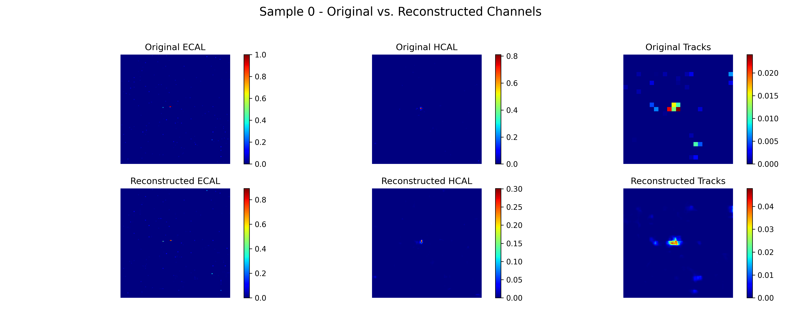
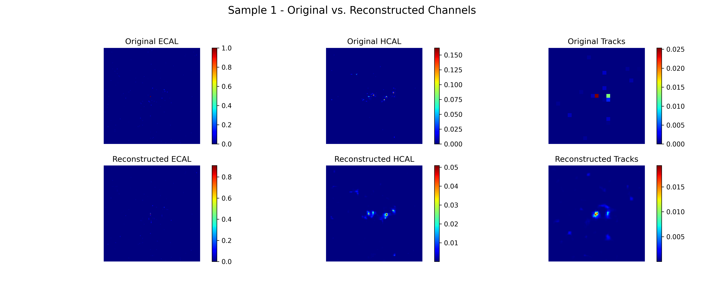
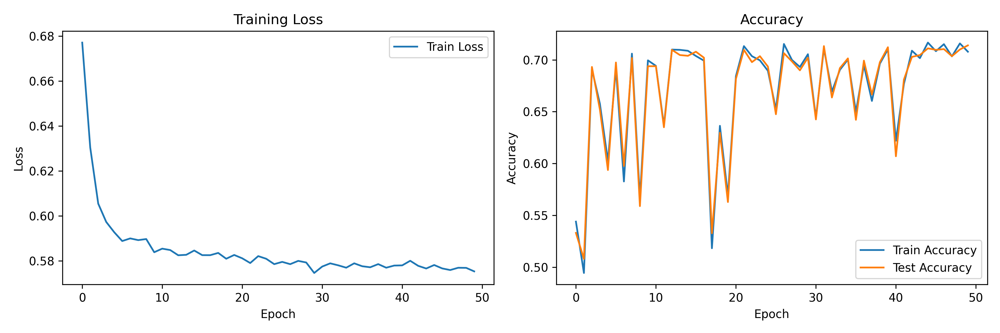
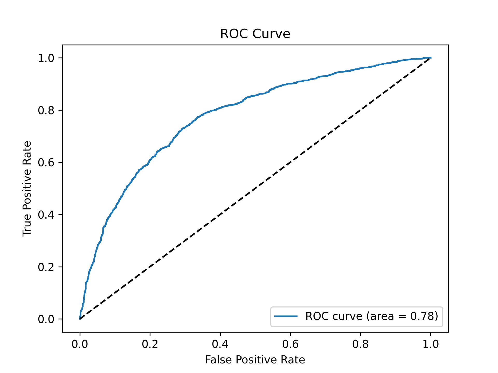
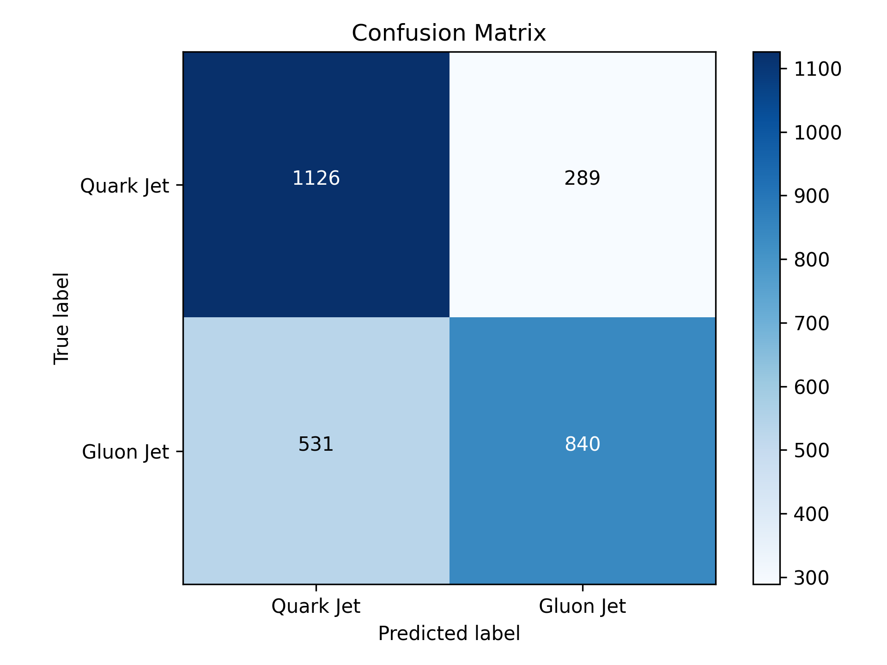
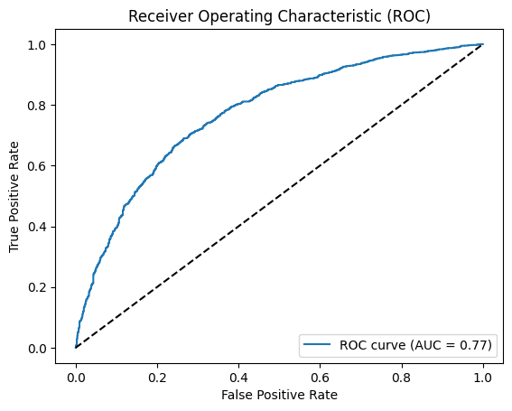
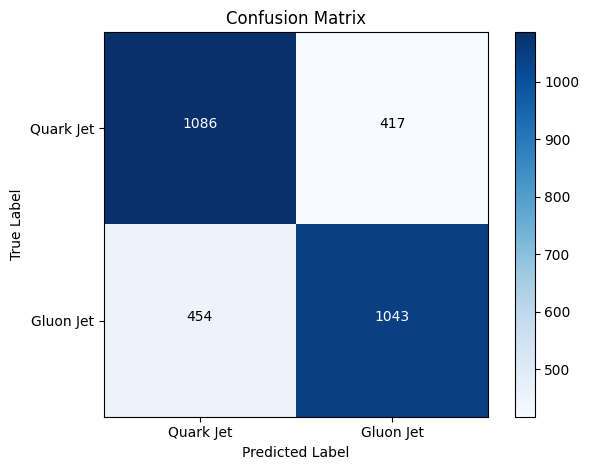

# GENIE-Tests
# Common Task 1: Auto-encoder for Quark/Gluon Event Reconstruction

  

  

  

# Common Task 2: Jets as Graphs

  

  

  

# Specific Task 1: Deep Graph Anomaly Detection with Contrastive Learning

  

  

